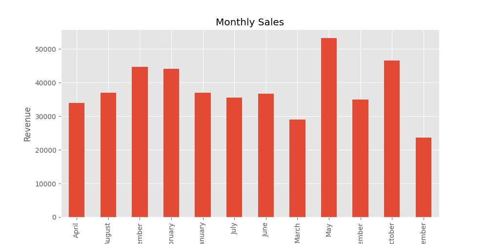
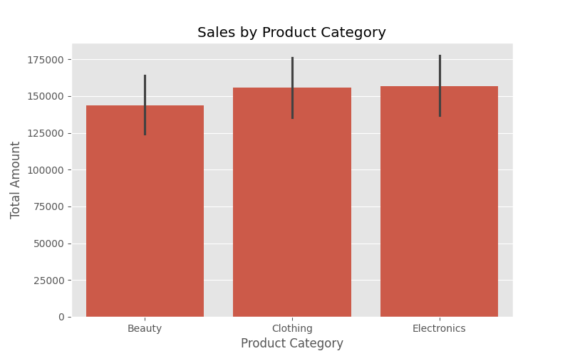
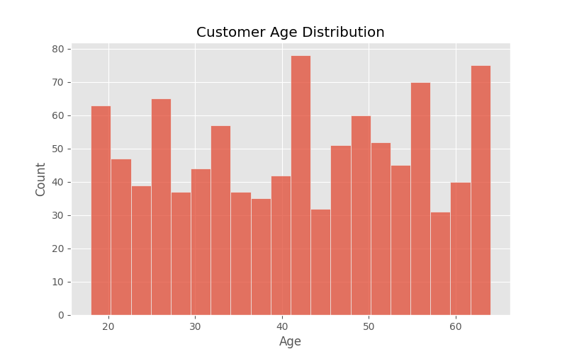
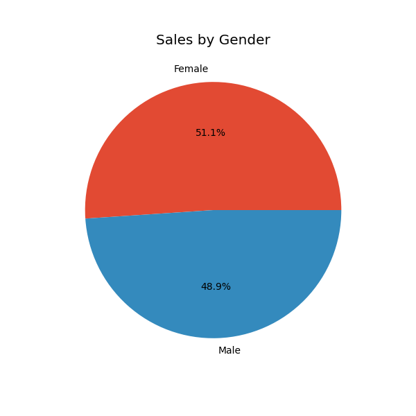
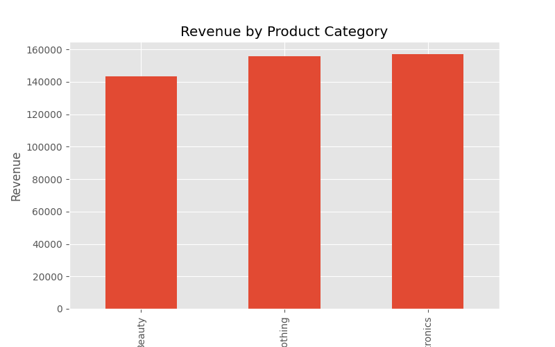

# 🛒 Real-World Retail Sales Analysis


---

# 📌 Overview

This project performs an end-to-end analysis of a real-world retail sales dataset to uncover customer behavior, product performance, and sales trends. Using Python and data visualization techniques, the project provides meaningful business insights that can support data-driven decision-making.

---

# 🎯 Project Objectives

- Analyze retail sales data
- Identify customer purchasing patterns
- Explore product category performance
- Visualize sales trends
- Generate business insights from real-world data

---

# 🛠️ Technologies Used

- Python
- Pandas
- NumPy
- Matplotlib
- Seaborn
- Jupyter Notebook (Google Colab)

---

# 📊 Exploratory Data Analysis

The following analyses were performed:

- Dataset Overview
- Data Cleaning
- Missing Value Analysis
- Monthly Sales Analysis
- Product Category Analysis
- Customer Age Distribution
- Gender-wise Sales Analysis
- Correlation Heatmap
- Revenue Analysis

---

# 📈 Visualizations

## Monthly Sales



---

## Product Category Sales



---

## Customer Age Distribution



---

## Gender-wise Sales



---

## Correlation Heatmap


---

## Revenue by Product Category



---

# 📂 Project Structure

```text
Real-World-Retail-Sales-Analysis
│
├── data/
│   └── retail_sales_dataset.csv
│
├── images/
│   ├── monthly_sales.png
│   ├── category_sales.png
│   ├── customer_age_distribution.png
│   ├── gender_sales.png
│   ├── correlation_heatmap.png
│   └── revenue_by_product.png
│
├── retail_sales_analysis.ipynb
├── requirements.txt
└── README.md
```

---

# 🔍 Key Business Insights

- Sales varied across different product categories.
- Monthly sales trends highlighted periods of higher revenue.
- Customer demographics influenced purchasing behavior.
- Product categories contributed differently to overall revenue.
- Correlation analysis identified relationships among numerical variables.

---

# 🚀 How to Run the Project

1. Clone the repository.

```bash
git clone https://github.com/Asifa007/Real-World-Retail-Sales-Analysis.git
```

2. Install the required libraries.

```bash
pip install -r requirements.txt
```

3. Open the notebook.

```text
retail_sales_analysis.ipynb
```

4. Run all cells to reproduce the analysis.

---

# 📦 Requirements

```
pandas
numpy
matplotlib
seaborn
```

---

# 👩‍💻 Author

**Asifa Firdhouse**

Artificial Intelligence & Machine Learning Student

- 💻 Passionate about Data Science & Machine Learning
- 📊 Interested in Business Analytics and AI
- 🌱 Continuously learning and building real-world projects

---

⭐ If you found this project useful, consider giving it a star!
